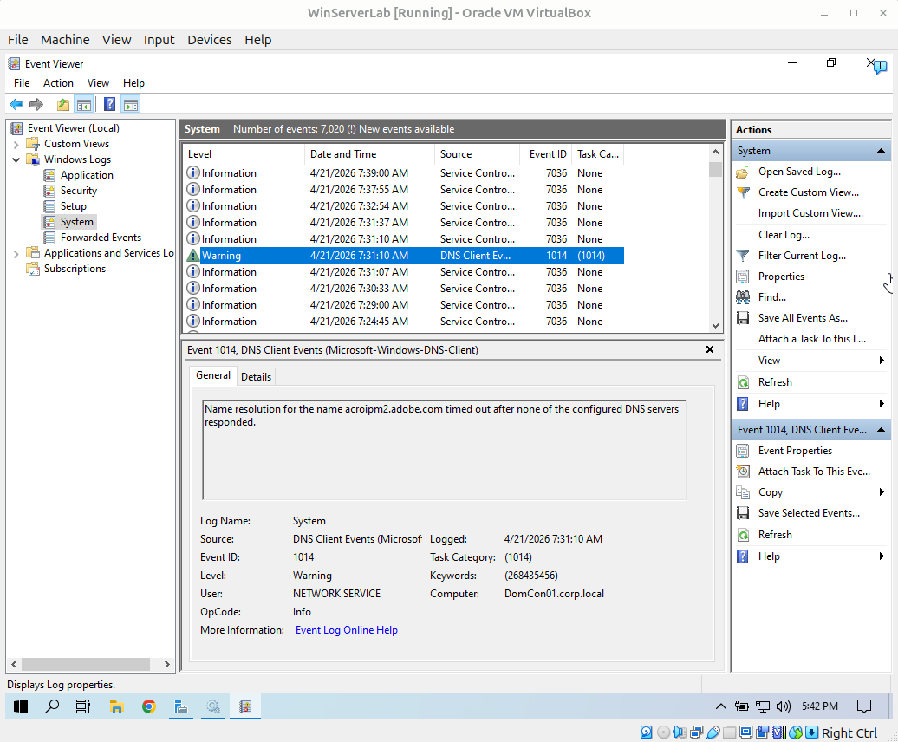
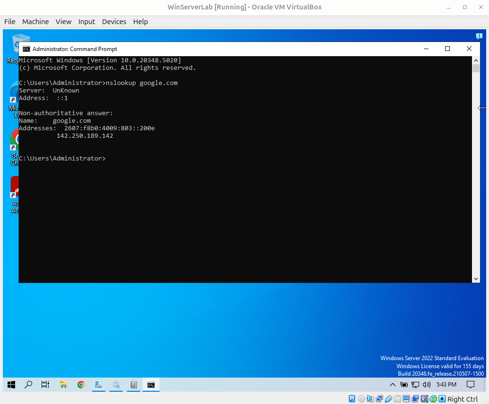

**Windows Event Viewer DNS Monitoring Lab**

I built this Windows Server lab in Oracle VM VirtualBox to practice reviewing system warning events and verifying DNS functionality. I discovered an alert appearing in Event Viewer. This lab shows how a warning event can be examined and then tested to determine whether the issue is still active.

Lab Objective

The goal of this lab was to review a DNS warning event inside Windows Event Viewer and then verify live DNS resolution using Command Prompt. I wanted to see if it was still an issue or if it had been resolved. This demonstrates a simple monitoring and response workflow that is similar to how support teams review alerts.

Lab Objectives
- Open Event Viewer and review System logs
- Identify a DNS warning event
- Examine Event ID 1014 details
- Interpret what the warning means
- Run `nslookup` to test live DNS resolution
- Compare logged event data with current system behavior
- Event Viewer Review

I opened Event Viewer and reviewed the System log under Windows Logs. I searched for a warning or an error. I selected a DNS warning event and examined Event ID 1014. The event showed that name resolution timed out because none of the configured DNS servers responded at that moment.

This shows how Windows records warning events that may indicate temporary service interruption or delayed communication.

DNS Verification with `nslookup`

After reviewing the warning, I opened Command Prompt and ran `nslookup google.com` to test whether DNS resolution was working during the live test that I was performing.

The command returned valid IP addresses, which showed that DNS was resolving normally during my test.

This shows how a logged warning should be verified before deciding whether the issue is active or temporary.

Why This Matters

This is important because warning events do not always mean a current outage. In IT support, it is important to review the event, verify the current system state, and then decide whether escalation is necessary.

This lab demonstrates practical troubleshooting discipline.

Skills Practiced
- Windows Event Viewer
- DNS troubleshooting
- Event interpretation
- nslookup
- Windows Server administration
- Verification before escalation

What I Learned

I learned how to connect a warning event in Event Viewer to a live troubleshooting step. I also learned that a DNS timeout warning can appear even when DNS later resolves normally.

This reinforced the importance of checking current system behavior before assuming there is an active problem.

Summary

This lab demonstrates how Windows event logs support practical troubleshooting. I reviewed a DNS warning event, interpreted the event details, and verified DNS functionality through Command Prompt.

This reflects the same basic thought process used in technical support when reviewing alerts and deciding the next steps.

Navigation

[`Back to GitHub Profile`](https://www.github.com/cbueker-it)
